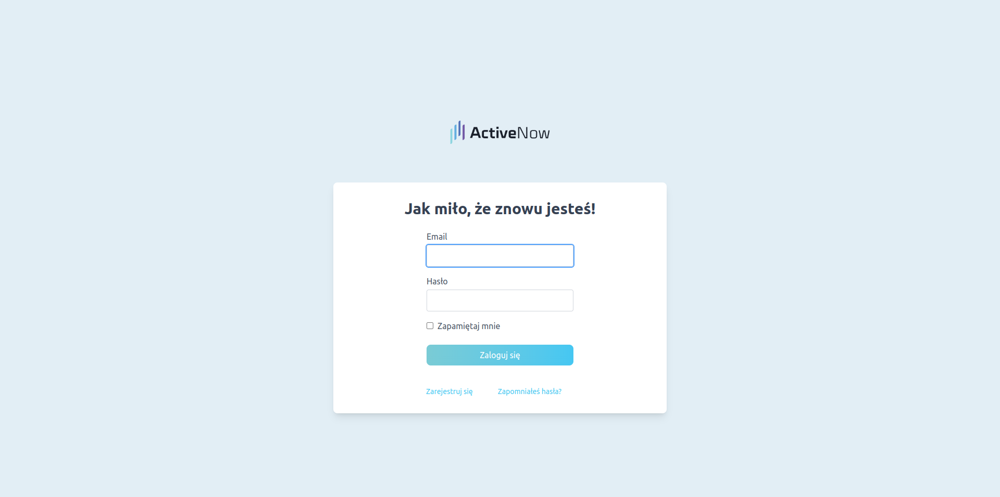
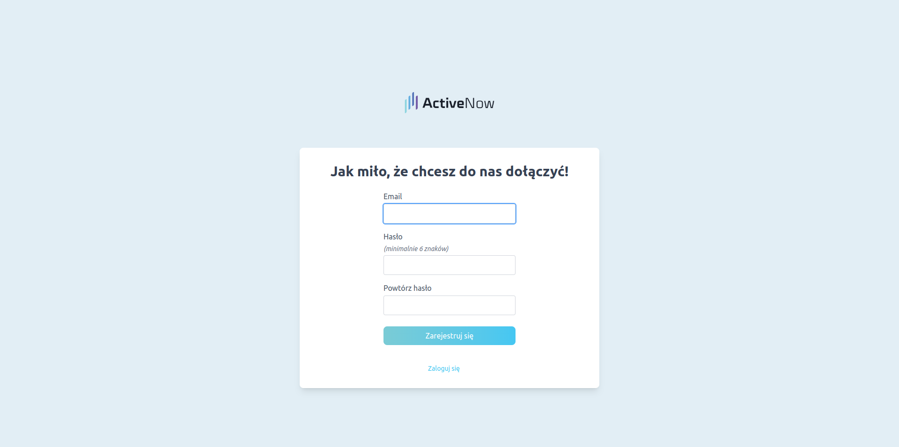
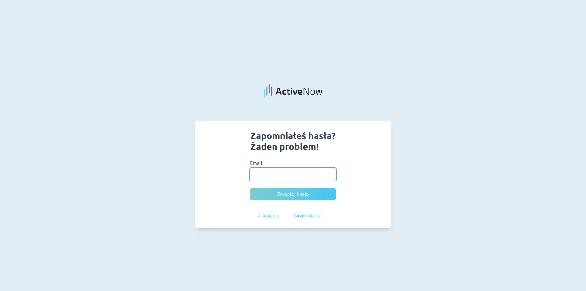
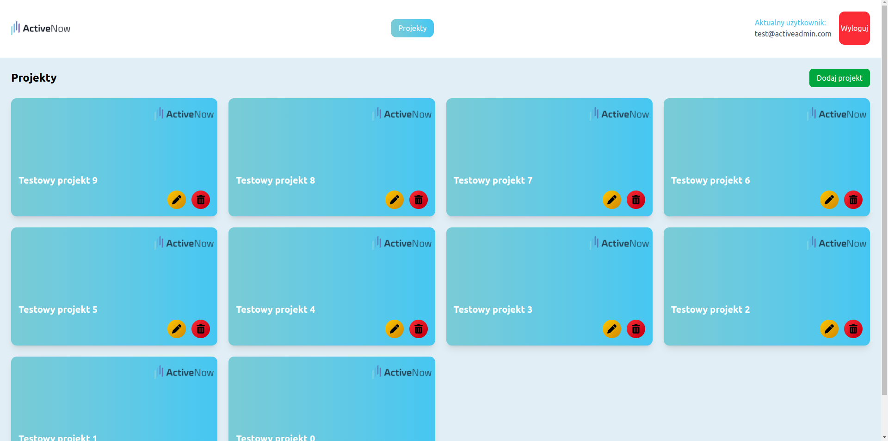
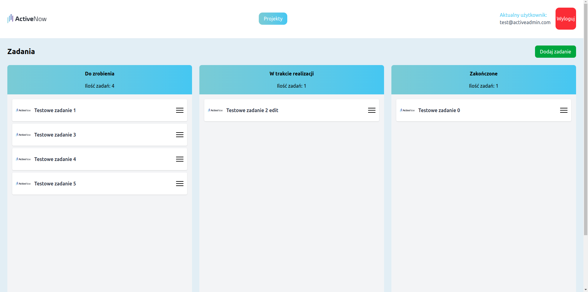
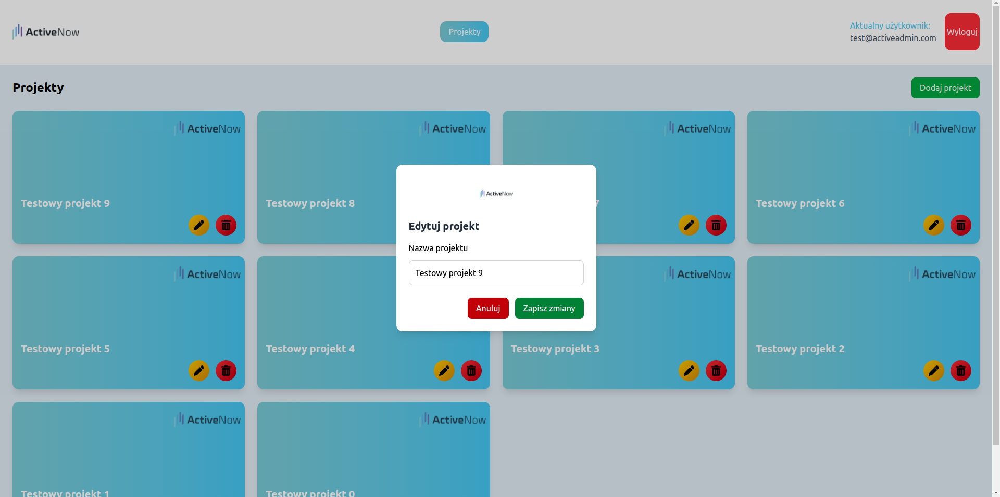
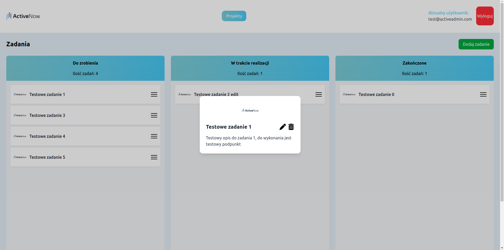
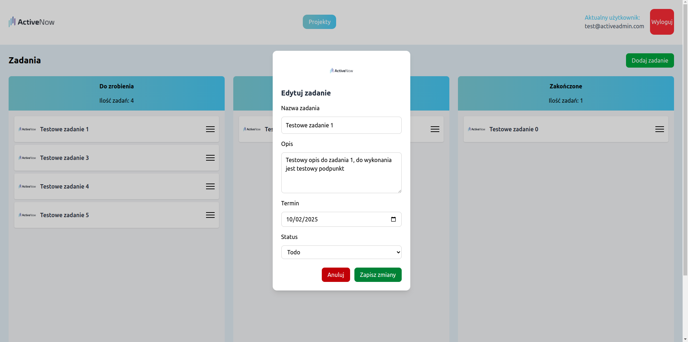
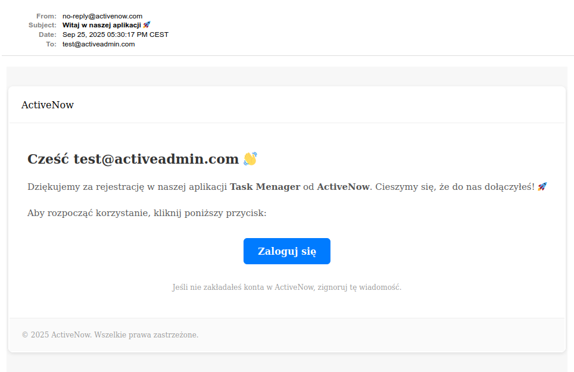
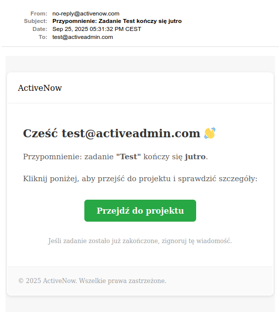

# Task Menager for ActiveNow

## 🛠️ Technologies

### Backend
- **Ruby on Rails 8.0.1**: Server-side framework
- **PostgreSQL**: Primary database system
- **Devise**: Authentication solution
- **Sidekiq**: Background jobs
- **Dry-validation**: Object schema validation
- **ViewComponent**: Reusable UI components
- **RSpec**: Automated testing framework

### Frontend
- **Hotwire (Turbo & Stimulus)**: Modern, minimal-JavaScript approach
- **Tailwind CSS Framework**: Responsive UI design
- **ViewComponents**: Component-based UI architecture

## 📸 Application Screenshots

### Login page


### Sign in page


### Reset password page


### Projects List


### Show project page


### Edit project page


### Show task page


### Edit task page


### New user email preview


### Due soon email preview


### Video preview


---

## ⚙️ Technical Setup

Below you’ll find technical installation instructions for both classic and Dockerized setups.

### Prerequisites (classic setup)
- Ruby 3.x
- Rails 8.0.1
- PostgreSQL

### Classic Installation

1. Clone the repository:
    ```bash
    git clone git@github.com:Nevelito/activenow_zadanie_rekrutacyjne.git
    cd activenow_zadanie_rekrutacyjne
    ```

2. Install dependencies:
    ```bash
    bundle install
    ```

3. Setup database:
    ```bash
    rails db:create 
    rails db:migrate
    rails db:seed
    ```

4. Start the server:
    ```bash
    bin/dev
    ```

# Test

Task Menager uses [RSpec](https://github.com/rspec/rspec-rails) to automate testing. The test suite primarily covers controllers, components, ensuring the reliability and correctness of the application's core logic.

1. Run RSpec test in terminal:
    ```bash
    rspec
    ```
   
2. Test new User email preview:
   ```bash
    rails c
    user = User.last
    UserMailer.welcome_email(user).deliver_now  
    ```

3. Test due soon email preview:
   ```bash
    rails c
    task = Task.last
    TaskMailer.due_soon_email(task).deliver_now  
    ```

